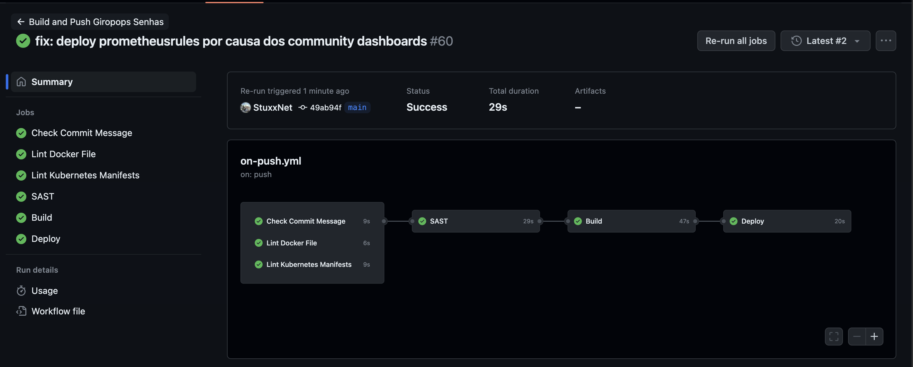
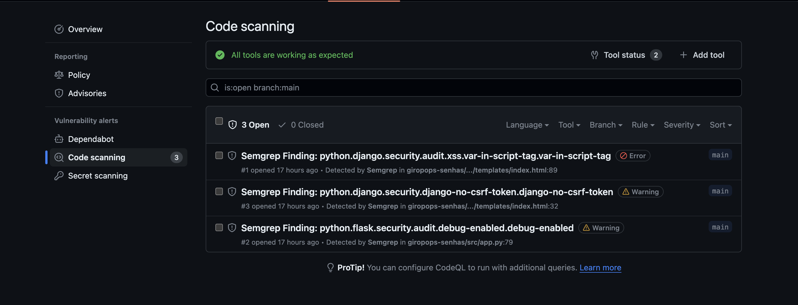

# Giropops Senhas - Um Esquenta :) 

Este repositório foi criado com o intuíto de praticar parte dos conceitos aprendidos durante o primeiro semestre do [PICK - Programa Intensivo de Container e Kubernetes da Linuxtips](https://www.linuxtips.io/escolher-plano)

Neste repositório você consegue:
- Preparar um ambiente local para testar a aplicação Giropops-Senhas;
- Subir o mesmo ambiente na AWS;
- Pipeline para lint, test, build e deploy no ambiente na AWS usando GitHub Actions.

## Ferramentas Necessárias

Não faz parte do escopo deste repositório fazer a instalação das ferramentas abaixo citadas. O papel de realizar a instalação de cada uma delas é seu. As ferramentas são:
- [Docker](https://www.docker.com/);
- [Kind](https://kind.sigs.k8s.io/);
- [Eksctl](https://eksctl.io/);
- [Helm](https://helm.sh/);
- [Kubectl](https://kubernetes.io/docs/reference/kubectl/);
- [Trivy](https://github.com/aquasecurity/trivy);
- [Cosign](https://github.com/sigstore/cosign);
- [Make](https://www.gnu.org/software/make/);
- [kustomize](https://kustomize.io/);
- [Jq](https://jqlang.github.io/jq/).

## Setup Inicial

Para subir o seu ambiente local será necessário carregar algumas variáveis de ambiente. Faça uma cópia do arquivo "[.env.example](./.env.example)" e renomeie este arquivo para ".env" preenchendo o conteúdo com as informações necessárias. Abaixo você encontra um descritívo de cada uma das variáveis.

```bash
K6_PROMETHEUS_RW_SERVER_URL # URL da Write API do Prometheus
GIROPOPS_SENHAS_TAG # Tag para build e teste - uso somente local
```

O carregamento pode ser feito com o comando abaixo:

```bash
$ source .env
```

## Makefile e os Targets

Este repositório possui um arquivo "[Makefile](./Makefile)" com diversos targets. Cada target é responsável por uma parte da solução cobrindo desde o deploy de cada peça da solução de maneira isolada até o deploy geral. 

Para entender quais os possíveis parâmetros do arquivo execute o comando:

```bash
$ make help
```

O retorno deverá ser algo similar ao que se encontra abaixo:

```bash
build-image: Realiza o build da imagem
build-scan-push-local: Realiza o build, análise e push da imagem para o cluster local para fim de testes
clean-aws: Clean do ambiente na AWS
clean-local: Clean do ambiente local
delete-eks-cluster: Remove o cluster na AWS
delete-giropops-senhas: Remove a instalação do Giropops Senhas
delete-ingress-eks: Realiza a deleção do ingress no EKS
delete-kind-cluster: Remove o cluster local
delete-kube-prometheus-stack: Remove a instalação do Prometheus
delete-metrics-server: Remove a instalação do Metrics Server no EKS
delete-redis: Remove a instalação do Redis
deploy-all-local: Sobe a infra completa localmente num cluster Kind
deploy-eks-cluster: Cria o cluster na AWS
deploy-giropops-senhas-aws: Realiza deploy no EKS
deploy-giropops-senhas-local: Realiza deploy no Kind
deploy-infra-aws: Sobe a infra completa na AWS
deploy-ingress-eks: Realiza o deploy do ingress no EKS
deploy-kind-cluster: Realiza a instalação do cluster local
deploy-kube-prometheus-stack-eks: Realiza a instalação do Prometheus no EKS
deploy-kube-prometheus-stack-local: Realiza a instalação do Prometheus localmente
deploy-metrics-server-eks: Realiza a instalação do Metrics Server no EKS
deploy-metrics-server-local: Realiza a instalação do Metrics Server no Kind
deploy-redis-eks: Realiza a instalação do Redis no EKS
deploy-redis-local: Realiza a instalação do Redis localmente
drop-pdb: Dropa os PDBs do cluster
help: Mostra help
lint-dockerfile: Lint Dockerfile
lint-manifests: Lint kubernetes manifests
load-hosts: Adiciona hosts localmente (unix-like only!)
push-image-dockerhub-ci: Realiza o push da imagem para o Dockerhub - Somente CI
scan-image: Realiza o scan da imagem usando Trivy
set-context-eks: Atualiza contexto para EKS
set-context-kind: Atualiza contexto do Kind
start-loadtest: Executa loadtest usando K6 enviando os resultados para o Prometheus
```

Agora basta escolher o target desejado e fazer a execução, como por exemplo:

```bash
$ make deploy-kind-cluster
```

Este comando, por exemplo, irá criar o cluster kind local com 3 worker nodes, ingress e metric server instalado para que você faça o deploy das demais partes do projeto.

## Configuração dos Hosts Locais

O funcionamento total das aplicações em ambiente local depende também da adição das seguintes entradas no seu arquivo hosts:

```
127.0.0.1 giropops-senhas.kubernetes.docker.internal
127.0.0.1 alertmanager.kubernetes.docker.internal
127.0.0.1 prometheus.kubernetes.docker.internal
127.0.0.1 grafana.kubernetes.docker.internal
```

Ou então uma entrada única com wildcard:

```
127.0.0.1 *.kubernetes.docker.internal
```

Em ambientes unix-like o comando abaixo pode ser usado para realizar a tarefa automaticamente:

```bash
$ make load-hosts
```

### Subindo o Ambiente Local

Para subir o ambiente local de uma só vez execute o comando:

```bash
$ make deploy-all-local
```

Após a execução do comando acima e a configuração do seu arquivos hosts como explicado na sessão anterior basta acessar as URLs abaixo para abrir cada uma das aplicações:
- [Grafana](http://grafana.kubernetes.docker.internal);
- [Prometheus](http://prometheus.kubernetes.docker.internal);
- [AlertManager](http://alertmanager.kubernetes.docker.internal);
- [Giropops-Senhas](http://giropops-senhas.kubernetes.docker.internal);

## Load-Test

Para realizar um stress-test na aplicação basta executar o comando abaixo:

```bash
$ make start-loadtest
```

Ele iniciará o stress-test da aplicação usando como base o scrit [generate-keys.js](./loadtest/generate-keys.js) e enviará os dados para o Prometheus. Lá você poderá visualizar os resultados do seu teste buscando pelo "Test ID" na barra superior. Vale ressaltar que o envio do resultado depende da configuração da variável de ambiente apontando para a API do Prometheus.


## Ambiente na AWS, e Trabalhando com GitHub;

Como explicado no começo deste arquivo o repositório também oferece a possibilidade de fazer o deploy dos componentes de infra-estrutura na AWS, bem como a execução de forma automatizada dos testes, build e deploy do Giropops Senhas nesse novo cluster na AWS.

### Subindo o Ambiente

Disclaimer inicial: Não faz parte do escopo deste tutorial explicar o processo de autenticação com a AWS. A geração da sua secret access key e secret key ID, bem como as roles necessárias no IAM ficam sob responsabilidade da pessoa que estiver utilizando este repositório.

Antes de executar o comando que sobe a infraestrutura na AWS faz-se necessário algumas alterações nos arquivos de configuração tanto do Prometheus quanto do Giropops Senhas. As aplicações em questão foram expostas para o mundo externo usando [Ingress NGINX Controller](https://docs.nginx.com/nginx-ingress-controller/), e para que o seu tráfego seja direcionado você precisá adaptar os arquivos de valores do helm com o seu domínio para ajustar o ingress na seguinte apps:
- [Prometheus](./configs/helm/kube-prometheus-stack/values-eks.yml#L30);
- [Grafana](./configs/helm/kube-prometheus-stack/values-eks.yml#L18);
- [AlertManager](./configs/helm/kube-prometheus-stack/values-eks.yml#L9);
- [Giropops Senhas](./giropops-senhas/manifests/overlays/eks/ingress.yml#L8).

Tendo isso pronto, basta você fazer o deploy da stack de infra na AWS executando o comando:

```bash
$ make deploy-infra-aws
```

Ao fim deste comando você terá um cluster gerenciado (EKS) rodando na AWS devidamente preparado com os plugins necessários para subir os componentes de infra-estrutura. O próximo passo consiste em você alterar o seu domínio adicionando uma entrada CNAME apontando para o balanceador de cargas do Ingress. O endereço do load-balancer fica disponível no próprio service dentro do Kubernetes. Para verificar basta executar o comando abaixo:

```bash
$ kubectl get service -n ingress-nginx
```

O resultado deve ser algo parecido com a saída abaixo:

```bash
NAME                                 TYPE           CLUSTER-IP       EXTERNAL-IP                                                                        PORT(S)                      AGE
ingress-nginx-controller             LoadBalancer   10.100.130.143   ae26f6b84c9174fada7483c24ad9e07d-70323fd382e6ef0b.elb.eu-central-1.amazonaws.com   80:30068/TCP,443:32687/TCP   73s
ingress-nginx-controller-admission   ClusterIP      10.100.54.121    <none>                                                                             443/TCP                      73s
```

### Deploy com GitHub Actions

Este repositório possui um arquivo simples de CI que executa uma pipeline com os seguinte steps:
- Lint;
- Test;
- Build;
- Deploy.

a etapa de deployment fará a entrega do Giropops Senhas no cluster EKS criado na etapa anterior. Para tal, em seu repositório os secrets abaixo precisam ser adicionados afim de autenticar o CI junto ao cluster:
- AWS_ACCESS_KEY_ID;
- AWS_SECRET_ACCESS_KEY.

Uma pipeline bem sucedida terá a seguinte saída:



Além do deploy o arquivo de CI também fará o upload dos secutiry findings tanto do código quanto do container para a aba de security, e lá eles devem ser analisados com mais cuidado afim de trazer uma etapa de melhoria contínua da aplicação:



## Pontos de melhoria:

Existem uma série de pontos neste repositório que ainda podem ser melhorados, como por exemplo:
- Autenticação via OpenID Connect para deploy na AWS, eximindo assim a necessidade de um par de chaves para deploy;
- Melhoria da bateria de testes incluindo:
    - Testes de lint específicos de Python
    - Testes unitários;
    - Testes end-2-end;
    - Coverage report;
    - Code Quality com SonarQube.
- Melhoria dos recursos alocados para cada um dos deployment realizados no cluster;
- Converter o Giropops Senhas para Helm;
- Melhoria no tempo de probs, pois o app é bastante leve;
- Fixar a versão do charts para evitar surpresas e updates indesejados.