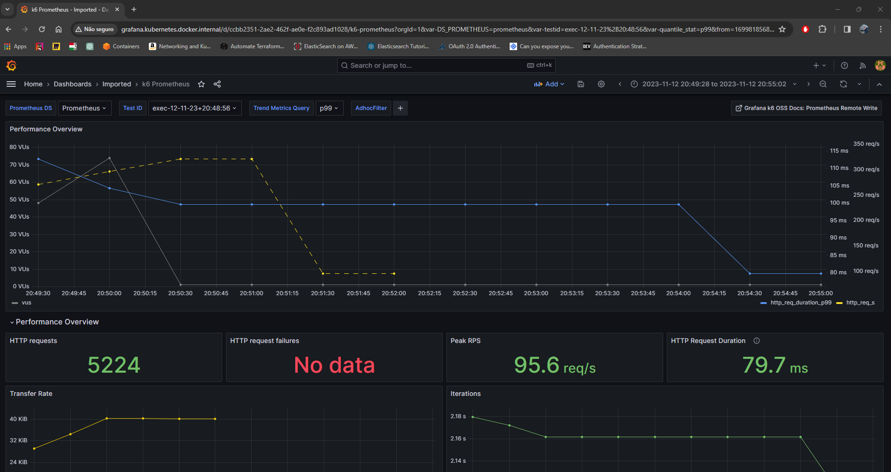

# Giropops Senhas - Um Esquenta :) 

Este repositório foi criado com o intuíto de praticar parte dos conceitos aprendidos durante o primeiro semestre do [PICK - Programa Intensivo de Container e Kubernetes da Linuxtips](https://www.linuxtips.io/escolher-plano)

Neste repositório você consegue:
- Preparar um ambiente local para testar a aplicação Giropops-Senhas;
- Subir o mesmo ambiente na AWS.

## Ferramentas Necessárias

Não faz parte do escopo deste repositório fazer a instalação das ferramentas abaixo citadas. O papel de realizar a instalação de cada uma delas é seu. As ferramentas são:

- [Docker](https://www.docker.com/);
- [Kind](https://kind.sigs.k8s.io/);
- [EKSCTL](https://eksctl.io/);
- [Helm](https://helm.sh/);
- [Kubectl](https://kubernetes.io/docs/reference/kubectl/);
- [Trivy](https://github.com/aquasecurity/trivy);
- [Cosign](https://github.com/sigstore/cosign);
- [NPM](https://www.npmjs.com/);
- [Make](https://www.gnu.org/software/make/).

## Setup Inicial

Para facilitar o setup da aplicação, bem como evitar commits com informações sensíveis, este respositório faz uso do CLI "[dotenv-cli](https://www.npmjs.com/package/dotenv-cli)" que deve ser instalado usando "npm".

```bash
$ npm install -g dotenv-cli
```

Após a instalação do CLI faça uma cópia do arquivo "[.env.example](./.env.example)" e renomeie este arquivo para ".env" preenchendo o conteúdo com as informações necessárias. Abaixo você encontra um descritívo de cada uma das variáveis.

```bash
K6_PROMETHEUS_RW_SERVER_URL # URL da Write API do Prometheus
GIROPOPS_SENHAS_TAG # Tag para build e teste - uso somente local
```

Para o funcionamento total das aplicações em ambiente local adicione também as seguintes entradas no seu arquivo hosts:

```
127.0.0.1 giropops-senhas.kubernetes.docker.internal
127.0.0.1 alertmanager.kubernetes.docker.internal
127.0.0.1 prometheus.kubernetes.docker.internal
127.0.0.1 grafana.kubernetes.docker.internal
```

Ou então uma entrada única com wildcard:

```
127.0.0.1 *.kubernetes.docker.internal
```

## Makefile e os Targets

Este repositório possui um arquivo "[Makefile](./Makefile)" com diversos targets. Cada target é responsável por uma parte da solução cobrindo desde o deploy parte por parte até o deploy geral. 

Para entender quais os possíveis parâmetros do arquivo execute o comando:

```bash
$ make help
```

O retorno deverá ser algo como o abaixo:

```bash
build-image: Realiza o build da imagem
build-scan-push-local: Realiza o build, análise e push da imagem para o cluster local para fim de testes
delete-eks-cluster: Remove o cluster na AWS
delete-giropops-senhas: Remove a instalação do Giropops
delete-ingress-eks: Realiza a deleção do ingress no EKS
delete-kind-cluster: Remove o cluster local
delete-kube-prometheus-stack: Remove a instalação do Prometheus
delete-redis: Remove a instalação do Redis
deploy-all-aws: Sobe a infra completa localmente num cluster Kind
deploy-all-local: Sobe a infra completa localmente num cluster Kind
deploy-eks-cluster: Cria o cluster na AWS
deploy-giropops-senhas: Realiza a instalação do Giropops
deploy-ingress-eks: Realiza o deploy do ingress no EKS
deploy-kind-cluster: Realiza a instalação do cluster local
deploy-kube-prometheus-stack-eks: Realiza a instalação do Prometheus no EKS
deploy-kube-prometheus-stack-local: Realiza a instalação do Prometheus localmente
deploy-redis-eks: Realiza a instalação do Redis no EKS
deploy-redis-local: Realiza a instalação do Redis localmente
help: Mostra help
lint-dockerfile: Lint Dockerfile
lint-manifests: Lint kubernetes manifests
push-image-dockerhub-ci: Realiza o push da imagem para o Dockerhub - Somente CI
scan-image: Realiza o scan da imagem usando Trivy
start-loadtest: Executa loadtest usando K6 enviando os resultados para o Prometheus
```

Agora basta escolher o target desejado e fazer a execução, como por exemplo:

```bash
$ make deploy-kind-cluster
```

Este comando irá criar o cluster kind local com 3 replicas com ingress e metric server instalado para que você faça o deploy das demais partes do projeto.

### Subindo o Ambiente Local

Para subir o ambiente local de uma só vez execute o comando:

```bash
$ make deploy-all-local
```

Após o setup iniciado, basta acessar as URLs abaixo para abrir cada uma das aplicações:

- [Grafana](http://grafana.kubernetes.docker.internal);
- [Prometheus](http://prometheus.kubernetes.docker.internal);
- [AlertManager](http://alertmanager.kubernetes.docker.internal);
- [Giropops-Senhas](http://giropops-senhas.kubernetes.docker.internal);

A app [Giropops-Senhas](http://giropops-senhas.kubernetes.docker.internal) está usando uma imagem que buildei localmente. Caso você deseje buildar a sua própria imagem basta garantir que o par de chaves para o [cosign](https://github.com/sigstore/cosign) funcionar estejam devidamente adicionadas no arquivo ".env", realizar o build chamando o target ```make build-image``` e depois alterando o arquivo [2. deployment.yml](./giropops-senhas/manifests/2.%20deployment.yml#L18) passando a sua imagem.

## Load-Test

Para realizar um stress-test na aplicação basta executar o comando abaixo:

```bash
$ make start-loadtest
```

Ele iniciará o stress-test da aplicação usando como base o scrit [generate-keys.js](./loadtest/generate-keys.js) e enviará os dados para o Prometheus. Lá você poderá visualizar os resultados do seu teste buscando pelo "Test ID" na barra superior:



## ToDos e Refinos

- [ ] Ajustar lint no CI que tá quebrando
- [ ] Update da documentação.